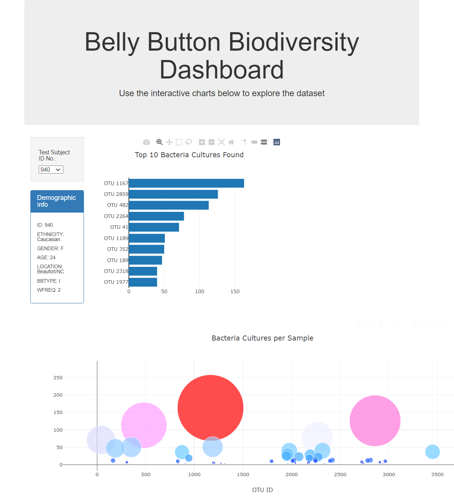

# Belly Button Biodiversity Ploly-chart
Utilize Ploly-chart, JavaScript and HTML to deploy visualized data.

## Overview of the Project
Using JavaScript, HTML, D3.js, Plotly.js, and CSS style sheet to visualize JSON file data to Bar Chart, Gauge Chart and Bubble Chart along with customizing HTML file taking below steps:

- Deliverable 1: Create a Horizontal Bar Chart
- Deliverable 2: Create a Bubble Chart
- Deliverable 3: Create a Gauge Chart
- Deliverable 4: Customize the Dashboard

## Resources
- Data Source: samples.json
- Software: Chrome Blowser, Visual Code Stuido, and Anaconda Prompt
- Image Source: <https://m.facebook.com/Belly-Button-Biodiversity-141859419220981/>

## Results
  
  1. Deliverable 1: Create a Horizontal Bar Chart
      
  ```
  function buildCharts(sample) {
  // 2. Use d3.json to load and retrieve the samples.json file 
  d3.json("static/data/samples.json").then((data) => {
    // 3. Create a variable that holds the samples array. 
    var samplesData = data.samples;
    // 4. Create a variable that filters the samples for the object with the desired sample number.
    var filteredData = samplesData.filter(sampleObj => sampleObj.id == sample);
    //  5. Create a variable that holds the first sample in the array.
    var firstSample = filteredData[0];

    // 6. Create variables that hold the otu_ids, otu_labels, and sample_values.
    var ids  = firstSample.otu_ids;
    var labels = firstSample.otu_labels.slice(0,10).reverse();
    var values = firstSample.sample_values.slice(0,10).reverse();

    var bubbleLabels = firstSample.otu_labels;
    var bubbleValues = firstSample.sample_values;
    // 7. Create the yticks for the bar chart.
    // Hint: Get the the top 10 otu_ids and map them in descending order  
    //  so the otu_ids with the most bacteria are last. 

    var yticks = ids.map(sampleObj => "OTU " + sampleObj).slice(0,10).reverse();
    console.log(yticks);

    // 8. Create the trace for the bar chart. 
    var trace = [{
        x: values,
        y: yticks,
        type: "bar",
        orientation: "h",
        text: labels
    }];
    // 9. Create the layout for the bar chart. 
    var barLayout = {
     title: "Top 10 Bacteria Cultures Found"
    };
    // 10. Use Plotly to plot the data with the layout. 
    Plotly.newPlot("bar", trace, barLayout);
  ```
  
   
     
  2.  Deliverable 2: Create a Bubble Chart
  ```
  // 1. Create the trace for the bubble chart.
    var bubbleData = [{
      x: ids,
      y: bubbleValues,
      text: bubbleLabels,
      mode: "markers",
        marker: {
          size: bubbleValues,
          color: bubbleValues,
          colorscale: 'Picnic'
        }
    }];

    // 2. Create the layout for the bubble chart.
    var bubbleLayout = {
      title: "Bacteria Cultures per Sample",
      xaxis: {title: "OTU ID"},
      automagine: true,
      hovermode: "closest"
    };

    // 3. Use Plotly to plot the data with the layout.
    Plotly.newPlot("bubble",bubbleData,bubbleLayout)
  ```
    
   
  
  3.  Deliverable 3: Create a Gauge Chart
  ```
  // 1. Create a variable that filters the metadata array for the object with the desired sample number.
  var metadata = data.metadata;
  var gaugeArray = metadata.filter(metaObj => metaObj.id == sample); 

  // 2. Create a variable that holds the first sample in the metadata array.
  var gaugeResult = gaugeArray[0];

  // 3. Create a variable that holds the washing frequency. 
  var wfreq = gaugeResult.wfreq;

  // 4. Create the trace for the gauge chart.
    var gaugeData = [{
      value: wfreq,
      type: "indicator",
      mode: "gauge+number",
      title: {text: "<b> Belly Button Washing Frequency</b><br>Scrubs Per Week"},
      gauge: {
        axis: {range:[null,10], dtick: "2"},
        bar: {color:"black"},
        steps:[
          {range:[0,2], color:"red"},
          {range:[2,4], color:"orange"},
          {range:[4,6], color:"yellow"},
          {range:[6,8], color:"lightgreen"},
          {range:[8,10],color:"green"}
        ],
        dtick:2
      }
    }];
    
    // 5. Create the layout for the gauge chart.
    var gaugeLayout = { 
      automargin: true
    };

    // 6. Use Plotly to plot the gauge data and layout.
    Plotly.newPlot("gauge",gaugeData,gaugeLayout)
   });
  }
  ```
     
   
  4.  Deliverable 4: Customize the Dashboard

   Lastly, I adjusted `Index.html` and `style.css` files to cutomize the output dashboard as follows;
  1. On `style.css` chained on `.jumbotron` to embed image file.
  ```
  .jumbotron {
    background-image: url("../images/top_image.jpg");
    background-size: 100% 100%;
    text-align: center;
  }
  ```
  2. On `style.css` adjusted `body` tag to change font color, background-color and also adjusted `.panel` class to re-adjust the font color of this section.
  ```
  .panel {
    color: black;
  }

  body {
      background-color: rgb(27, 108, 119);
      color: #f7f7f7;
  }
  ```
  3. Adjusted `<body>` tag, `<h5>` tag, and `<div>` inside `<div class="panel">` tag to change the background color and adjust font color.
  ```
  <body style="background-color:#5D6D7E">
  <div class="container">
    <div class="row">
      <div class="col-md-12 jumbotron text-center">
        <h1><b>Belly Button Biodiversity Dashboard</b></h1>
        <p>Use the interactive charts below to explore the dataset</p>
      </div>
    </div>
    <div class="row">
      <div class="col-md-2" >
        <div class="well" style="background-color:#A0B7E2">
          <h5 style="color:black"><b>Test Subject ID No.:</b></h5>
          <!-- <select id="selDataset"></select> -->
          <select id="selDataset" style="color:black" onchange="optionChanged(this.value)"></select>
        </div>
        <div class="panel panel-primary">
          <div class="panel-heading">
            <h3 class="panel-title" >Demographic Info</h3>
          </div>
          <div style="background-color:#A0B7E2" id="sample-metadata" class="panel-body" ></div>
  ```
  After these changes, the output image is as below.
  
     

